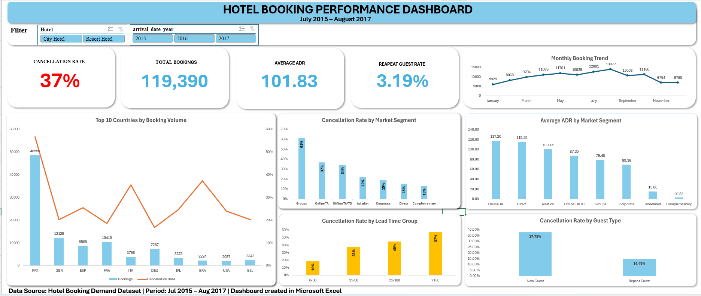

# 🏨 Hotel Booking Performance Analysis
Excel dashboard analyzing hotel booking demand, cancellation behavior, customer segmentation, and pricing performance.
## 📖 Project Overview
This project analyzes hotel booking demand, cancellation behavior, customer segments, and pricing performance using historical booking data. The analysis aims to support hotel management in understanding customer behavior and making more informed operational decisions.

## 🎯 Business Problem
Hotel management needs to better understand booking performance and customer behavior to identify booking patterns, reduce cancellations, and support data-driven business decisions.

## 👤Stakeholder
- Hotel General Manager

## 🎯 Objectives
- Analyze booking performance across hotel types, seasons, and customer segments.
- Identify factors associated with booking cancellations.
- Evaluate customer booking behavior.
- Generate actionable insights to support business decisions.

## ❓ Business Questions
1. What is the overall booking cancellation rate, and how does it vary by hotel type and market segment?
2. How do booking volumes vary across months?
3. Which market segment has the highest ADR?
4. Does lead time influence the booking cancellation rate?
5. How do repeat guests differ from new guests in terms of booking behavior and cancellation?
6. Which countries contribute the highest number of bookings and how do their cancellation rates compare? 
## 🧹 Dataset
Source: Hotel Booking Demand Dataset
Original paper: Nuno Antonio, Ana de Almeida, Luis Nunes (2019)
License: CC BY 4.0 
Download: https://www.kaggle.com/datasets/jessemostipak/hotel-booking-demand
119,390 bookings | 32 variables | Jul 2015 – Aug 2017
Data Notes:
• Missing values were reviewed.
• One negative ADR value and four missing children values were identified.
• Duplicate rows were retained because no unique booking ID is available. 
## 📈 Dashboard Preview

## 🔍 Key Findings

- The overall cancellation rate is **37.04%**, with **City Hotel (41.73%)** showing a considerably higher cancellation rate than **Resort Hotel (27.76%)**.
- Booking demand peaks from **April to October**, reaching its highest level in **August**, while cancellation rates remain relatively stable.
- **Online TA** records both the highest average ADR (**117.2**) and the largest booking volume.
- Cancellation rates increase as **lead time** becomes longer, reaching **57%** for bookings made more than 180 days in advance.
- **Repeat guests** cancel far less frequently than new guests (**14.5% vs. 37.8%**), while **Portugal** is both the largest source market and the highest-cancellation market among the top booking countries.
## 💡 Business Insights

- Cancellation behavior varies significantly across hotel types, market segments, and booking lead times, indicating that a single booking policy may not be effective for all customers.
- High booking demand during the peak season does not necessarily result in higher cancellation rates.
- **Online TA** is the hotel's most valuable booking channel because it combines both high booking volume and high ADR.
- Repeat guests demonstrate stronger booking commitment, while the Portugal market presents the greatest opportunity for reducing overall cancellations.
## ✅ Recommendations

- Review booking policies for high-risk customer segments and long lead-time reservations.
- Allocate operational resources based on seasonal booking demand and introduce targeted promotions during low-demand periods.
- Continue monitoring Online TA by evaluating booking volume, ADR, and cancellation rates together.
- Strengthen customer retention initiatives and investigate the high cancellation rate in the Portugal market.
## 🛠️ Tools Used

- Microsoft Excel
- Pivot Tables
- Pivot Charts
- Slicers
- Conditional Formatting
## 📂 Project Files
- 📈 [Excel Dashboard](dashboard/Hotel%20Booking%20Dashboard.xlsx)
